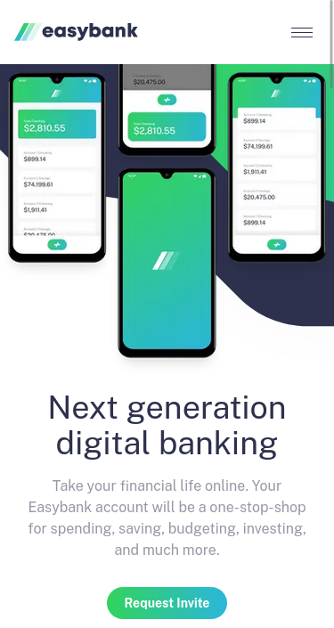

# Frontend Mentor - Easybank landing page solution

This is a solution to the [Easybank landing page challenge on Frontend Mentor](https://www.frontendmentor.io/challenges/easybank-landing-page-WaUhkoDN). Frontend Mentor challenges help you improve your coding skills by building realistic projects.

## Table of contents

- [Overview](#overview)
  - [The challenge](#the-challenge)
  - [Screenshot](#screenshot)
  - [Links](#links)
- [My process](#my-process)
  - [Built with](#built-with)
  - [What I learned](#what-i-learned)
  - [Continued development](#what-i-learned)
- [Author](#author)

**Note: Delete this note and update the table of contents based on what sections you keep.**

## Overview

### The challenge

Users should be able to:

- View the optimal layout for the site depending on their device's screen size
- See hover states for all interactive elements on the page

### Screenshot

### Links

- Solution URL: [Add solution URL here](https://github.com/TheMcnafaha/front-end-neo-easy-bank/tree/main)
- Live Site URL: [Add live site URL here](https://front-end-neo-easy-bank-git-main-themcnafaha.vercel.app/)

## My process

This is the second time I try this Challenge. The first time I tried my usual go to media-query approach were I built the entire website in a mobile media-query; then I build the longer/tablet webiste;
and last I build the desktop website. However, the CSS used to make the images move around, grow, and crop, required significantly more time to get right. So this time I built "section by section".
I got the intro part (the one with the img magic) first as mobile, then as tablet, and last as desktop. Ignoring the rest of the site until the intro was 90% of the way there and then moved on to the next
section and repeating the same steps I took with the previous one. I found this method to be a lot better since it maintained my focus on each section of the website instead of revisiting parts after
the fact.

### Built with

- Semantic HTML5 markup
- Flexbox
- CSS Grid
- Mobile-first workflow
- [Qwik](https://qwik.builder.io/) - JS library
- [Tailwind](https://tailwindcss.com/) - CSS framework
- [Flowbite](https://flowbite.com/) - Tailwind component Library

### What I learned

I learned that the new process I used is cool and that grid is magical.

### Continued development

I'd be interested in seeing a more accurate solution of the odd img manipulation the desing files had. My solution doesn't break the sections because of the W3C (you can't only hide overflow in one axis.
If you hide one overflow axis you hide both)

## Author

- Frontend Mentor - [@TheMcnafaha](https://www.frontendmentor.io/profile/TheMcnafaha)
